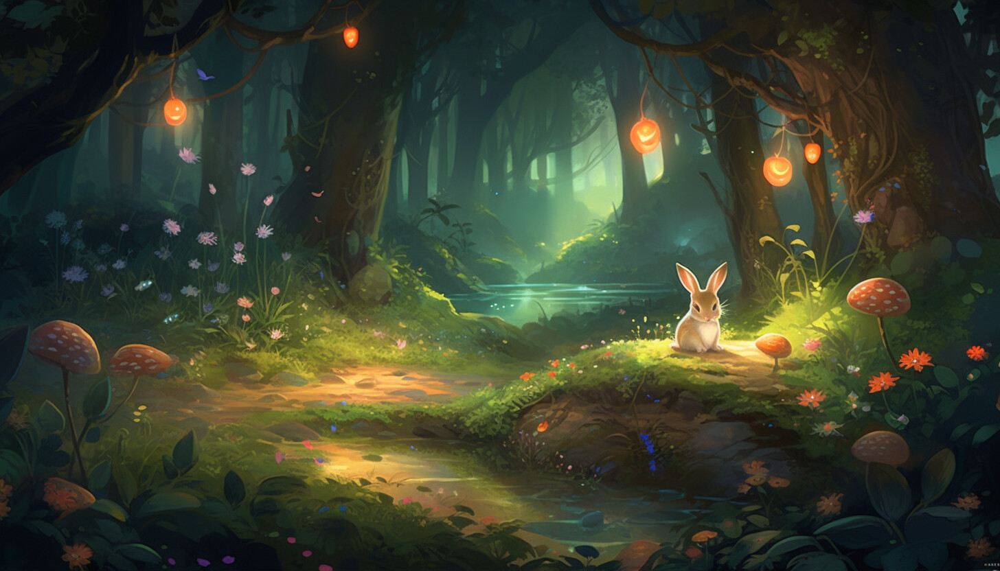

## The Magical Forest of Algora

### Background

Deep within the enchanted Forest of Algora, two mystical creatures, the Lox and the Faelis, perform a sacred dance every millennium. This dance is not just for celebration but is a ritual to bring balance to the forest.

### Objective

Your task is to simulate the dance between Lox and Faelis. Each creature has its own set of dance moves, and the combination of moves creates various magical effects in the forest. Your goal is to determine the state of the forest after the dance is complete.

### Specifications

1. **Dance Moves and Effects:**
    - Each creature can perform one of three dance moves: `Twirl`, `Leap`, or `Spin`.
    - The combination of moves from both creatures results in a magical effect:
        - Twirl + Twirl = Fireflies light up the forest.
        - Leap + Spin = Gentle rain starts falling.
        - Spin + Leap = A rainbow appears in the sky.
        - Other combinations create different effects that you can dream up.
  
2. **Dance Dynamics:**
    - Each effect will change the state of the forest.
    - Some effects can be beneficial, while others can be detrimental.

3. **Dance Sequence:**
    - The dance consists of 5 sequences.
    - You need to display the state of the forest after each sequence.

4. **Creature Moves:**

    **Moves for Lox (Creature 1)**

    | Sequence 1 | Sequence 2 | Sequence 3 | Sequence 4 | Sequence 5 |
    |------------|------------|------------|------------|------------|
    | Twirl      | Leap       | Spin       | Twirl      | Leap       |

    **Moves for Faelis (Creature 2)**

    | Sequence 1 | Sequence 2 | Sequence 3 | Sequence 4 | Sequence 5 |
    |------------|------------|------------|------------|------------|
    | Spin       | Twirl      | Leap       | Leap       | Spin       |

5. **Advanced Features (if time permits):**
    - Implement a system that allows users to add new dance moves and effects.
    - Users can select the dance move for each sequence.

### Constraints

- Use GitHub Copilot and write the simulation in any language you'd like.
- Focus on clear and concise code that handles the dance dynamics efficiently. Ask GitHub Copilot/Chat, "How can I make this code more readable and maintainable?".
- Creating a visual representation for the dance and effects is optional but encouraged if you have time.

### Summary of High-Level Steps to Perform

1. Initialize the state of the forest.
2. Each creature selects a dance move for each sequence.
3. Determine the effect of the combined dance moves on the forest.
4. Update the state of the forest after each sequence.
5. Display the final state of the forest after the dance is complete.

### Tips to Get Started

1. If you're using a GitHub Codespace, you're ready to go!
1. If running locally, ensure that you have your target language/framework installed. 
    - [Node.js](https://nodejs.org)
    - [Python](https://www.python.org/downloads/)
    - [.NET](https://dot.net)
1. Create a folder for your code. 
    - JavaScript: Create a folder called `tempora` and add a file named `app.js`.
    - Python: Create a folder called `tempora` and add a file named `app.py`.
    - C#: Create a folder called `tempora` and run `dotnet new console`;

### GitHub Copilot Tips

#### Use Copilot to improve efficiency

See if you can use Copilot to find out the complexity (BigO notation) of the code.

1. Open the [GitHub Copilot Chat view](https://docs.github.com/en/copilot/github-copilot-chat/using-github-copilot-chat#asking-your-first-question) in the sidebar if it's not already open. Make sure your solution file is still open as well.

1. Ask Copilot Chat what the complexity of the code is.

1. Ask Copilot Chat to make the code more efficient.

1. Ask for the complexity again - is it better?

#### Use Copilot to generate code comments

1. Highlight all of the code with <kbd>Ctrl</kbd>/<kbd>Cmd</kbd>+<kbd>A</kbd>.

1. Press <kbd>Ctrl</kbd>/<kbd>Cmd</kbd>+<kbd>I</kbd> to open the inline chat. 

1. Type "/doc"

1. Ask Copilot Chat to document the function.

#### Use Copilot to simplify your code

1. Open GitHub Copilot Chat in the sidebar.

1. Type "/simplify" and press <kbd>Enter</kbd>. You can also add any text you want after the "/simplify" to give Copilot more instructions.

1. What did Copilot Chat suggest you do to make it simpler?

#### Got Errors?

Copilot Chat can help with that too! Just copy the error message and paste it into Chat. Often that's all Copilot needs to resolve your issue.