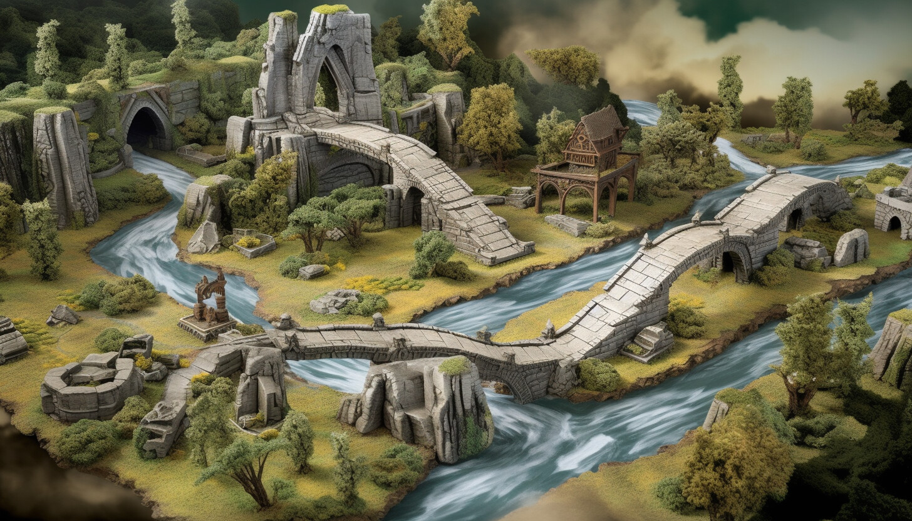

## The Legendary Duel of Stonevale

### Background

In the mystical realm of Stonevale, two warriors, Rok and Papyra, are chosen for a duel that determines the fate of their tribes for the next century. The arena, known as Scissoria, is where each move carries weight and consequences.

### Objective

Your task is to simulate the duel between Rok and Papyra. Each warrior makes a series of moves, and each move has a specific outcome. To win the duel, a warrior must accumulate the highest score over a series of rounds.

### Specifications

1. **Moves and Points:**
    - Each warrior can make one of three moves: rock, paper, or scissors.
        - A rock win = 1 point
        - A paper win = 2 points
        - A scissors win = 3 points

1. **Duel Dynamics:**
    - When both warriors choose the same move, it's a draw, and no points are awarded.
    - Rock crushes scissors, paper covers rock, and scissors cut paper.
    - Points are awarded based on the winning move.

1. **Gameplay:**
    - The duel consists of 5 rounds.
    - The goal is to accumulate the highest score over these rounds to win the duel.

1. **Player Moves:**

    **Moves for Rok (Player 1)**

    | Round 1 | Round 2 | Round 3 | Round 4 | Round 5 |
    |---------|---------|---------|---------|---------|
    | scissors    | paper   | scissors| rock    | rock   |

    **Moves for Paprya (Player 2)**

    | Round 1 | Round 2 | Round 3 | Round 4 | Round 5 |
    |---------|---------|---------|---------|---------|
    | rock | rock    | paper   | scissors| paper    |

1. **Advanced Features (if time permits):**
    - Implement a hint system that suggests a move to the player.
    - Players can select their move for each round rather than it being automated.

### Constraints

- Write the simulation using GitHub Copilot and any language you choose. Try learning a new language if you're up for the challenge!
- Ensure efficient algorithms to handle the duel dynamics. Ask GitHub Copilot/Chat, "How can I make this code more readable and maintainable?".
- Providing a graphical user interface for the simulation is optional.

### Summary of High-Level Steps to Perform

1. Initialize scores for both warriors.
1. Each warrior selects a move for each round.
1. Determine the winner of each round and award the points.
1. Tally the scores after 5 rounds.
1. Declare the overall winner of the duel.

### GitHub Copilot Tips

#### Use Copilot to improve efficiency

See if you can use Copilot to find out the complexity (BigO notation) of the code.

1. Open the [GitHub Copilot Chat view](https://docs.github.com/en/copilot/github-copilot-chat/using-github-copilot-chat#asking-your-first-question) in the sidebar if it's not already open. Make sure your solution file is still open as well.

1. Ask Copilot Chat what the complexity of the code is.

1. Ask Copilot Chat to make the code more efficient.

1. Ask for the complexity again - is it better?

#### Use Copilot to generate code comments

1. Highlight all of the code with <kbd>Ctrl</kbd>/<kbd>Cmd</kbd>+<kbd>A</kbd>.

1. Press <kbd>Ctrl</kbd>/<kbd>Cmd</kbd>+<kbd>I</kbd> to open the inline chat. 

1. Type "/doc"

1. Ask Copilot Chat to document the function.

#### Use Copilot to simplify your code

1. Open GitHub Copilot Chat in the sidebar.

1. Type "/simplify" and press <kbd>Enter</kbd>. You can also add any text you want after the "/simplify" to give Copilot more instructions.

1. What did Copilot Chat suggest you do to make it simpler?

#### Got Errors?

Copilot Chat can help with that too! Just copy the error message and paste it into Chat. Often that's all Copilot needs to resolve your issue.