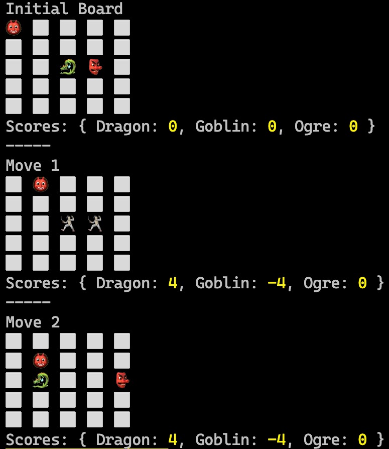

## The Gridlock Arena of Mythos

### Background

In the mystical land of Mythos, creatures from various realms come together to battle in the Gridlock Arena, a chess-like grid where strategy, power, and cunning are tested. Each creature has its unique move, power, and strategy.

### Objective

Your task is to simulate a battle in the Gridlock Arena. Each creature will make a series of moves, and after each move, the creature might inflict damage on its opponent if they land on the same square. The goal is to accumulate the highest score by the end of the battle. To track the progress of the battle, visualize the grid after each move and display the current scores right below the grid.

### Specifications

1. **Grid Dynamics:**
    - The Gridlock Arena is a 5x5 grid.
    - Each cell in the grid can be empty or occupied by a creature.
    - Creatures can move up, down, left, or right by one cell.

2. **Creature Data:**

    | Name   | Start | Moves                | Power | Icon |
    |--------|-------|----------------------|-------|------|
    | Dragon | 2,2   | RIGHT, LEFT, DOWN    | 7     | 🐉   |
    | Goblin | 2,3   | LEFT, RIGHT, UP      | 3     | 👺   |
    | Ogre   | 0,0   | RIGHT, DOWN, DOWN    | 5     | 👹   |

3. **Battle Dynamics:**
    - Creatures take turns making moves.
    - If two creatures land on the same cell after a move, they both inflict damage on each other.
    - Points are awarded based on the damage inflicted.
    - The battle ends when all moves are completed.

4. **Output:**
    - After each move, visualize the grid by printing it to the console using ⬜️ to represent a cell. 
    - Above the grid add a title that either says "Initial Board" (to show the initial state of the board) or "Move X" where X is the current move number.
    - Use each creature's icon to represent it on the grid. 
    - Empty cells can be represented by a ⬜️.
    - Battle cells can be represented by a 🤺.
    - Display the current scores for each creature right below the grid after each move.
    - At the end of the battle, return the total points each creature accumulated.

      
      

### Constraints

- Use GitHub Copilot and write the simulation in any language you'd like.
- Ensure efficient algorithms to handle the battle dynamics. Ask GitHub Copilot/Chat, "How can I make this code more readable and maintainable?".
- The program should have 100% test coverge. Use the /tests command in GitHub Copilot Chat.

### Getting Started

- Ensure that you have both the [GitHub Copilot](https://marketplace.visualstudio.com/items?itemName=GitHub.copilot) and [GitHub Copilot Chat](https://marketplace.visualstudio.com/items?itemName=GitHub.copilot-chat) extensions installed and are signed in to GitHub in VS Code.

#### Summary of High-Level Steps to Perform

1. **Define Constants and Data Structures**:
   - Define the `creatures` array containing the creature details.
   - Define a `directions` object to map the movement directions to their respective changes in coordinates.

2. **Initialize the Battle Grid**:
   - Set the grid size and create a 2D array (`grid`) with all cells initialized to `null`.

3. **Initialize Scores and Grid**:
   - Loop through each creature in the `creatures` array.
   - For each creature, initialize its score to 0 in the `scores` object.
   - Place each creature on the grid using its starting position and icon.

4. **Simulate Battle Moves**:
   - Loop through the number of moves, starting from -1 (to represent the initial state).
   - If it's the initial state (`move` is -1), render the grid.
   - If it's the last move, exit the loop after rendering.
   - For each move:
     - Determine the new position of the creature based on its move direction.
     - Check if the new position overlaps with another creature.
     - Update scores and grid state based on overlaps or successful moves.

5. **Render the Grid**:
   - For each state of the grid (initial and after each move):
     - Display the move number or "Initial Board" for the initial state.
     - Print the grid state with creatures or an empty cell representation.
     - Display the current scores for all creatures.

6. **Return Final Scores**:
   - After all moves have been simulated, return the final scores for each creature. 

### GitHub Copilot Tips

#### Use Copilot to improve efficiency

See if you can use Copilot to find out the complexity (BigO notation) of the code.

1. Open the [GitHub Copilot Chat view](https://docs.github.com/en/copilot/github-copilot-chat/using-github-copilot-chat#asking-your-first-question) in the sidebar if it's not already open. Make sure your solution file is still open as well.

1. Ask Copilot Chat what the complexity of the code is.

1. Ask Copilot Chat to make the code more efficient.

1. Ask for the complexity again - is it better?

#### Use Copilot to generate code comments

1. Highlight all of the code with <kbd>Ctrl</kbd>/<kbd>Cmd</kbd>+<kbd>A</kbd>.

1. Press <kbd>Ctrl</kbd>/<kbd>Cmd</kbd>+<kbd>I</kbd> to open the inline chat. 

1. Type "/doc"

1. Ask Copilot Chat to document the function.

#### Use Copilot to simplify your code

1. Open GitHub Copilot Chat in the sidebar.

1. Type "/simplify" and press <kbd>Enter</kbd>. You can also add any text you want after the "/simplify" to give Copilot more instructions.

1. What did Copilot Chat suggest you do to make it simpler?

#### Got Errors?

Copilot Chat can help with that too! Just copy the error message and paste it into Chat. Often that's all Copilot needs to resolve your issue.