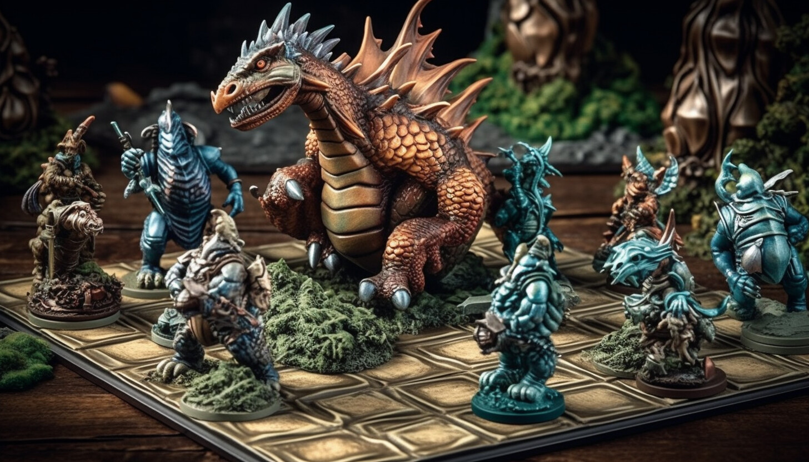
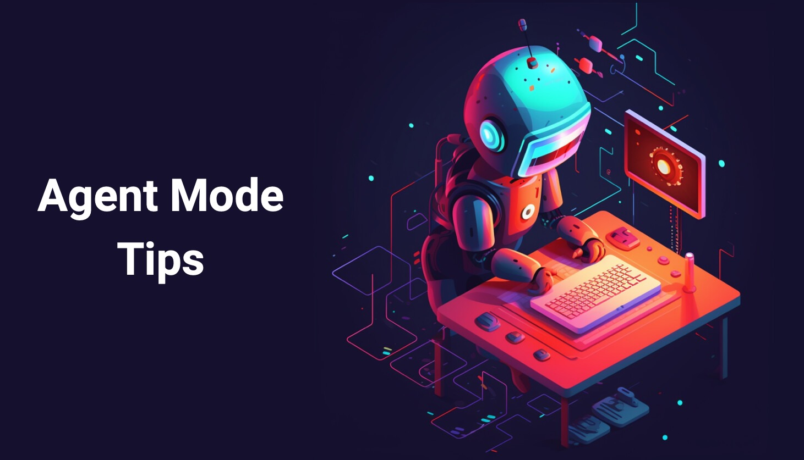

## The Gridlock Arena of Mythos - Agent Mode Adventure

<a href="#">
    
</a>

### Background

In the mystical land of Mythos, creatures from various realms come together to battle in the Gridlock Arena, a chess-like grid where strategy, power, and cunning are tested. Each creature has its unique move, power, and strategy. The arena is a 5x5 grid where creatures battle for supremacy, earning points by inflicting damage on opponents while avoiding taking damage themselves.

### Objective

Your task is to create a comprehensive battle simulation system for the Gridlock Arena. You'll need to implement grid-based movement, turn-based combat, collision detection, and a scoring system that tracks each creature's performance throughout the battle.

**In this adventure, you'll learn to use GitHub Copilot Agent Mode** - an autonomous AI assistant that can understand complex tasks and break them down into multiple steps, creating entire applications from scratch!

### Prerequisites

Before starting this adventure, you'll need to perform the following steps:

1. **Install VS Code** - Download from [VS Code](https://code.visualstudio.com/).
2. **Set up GitHub Copilot in VS Code** - Follow the instructions at [Set up GitHub Copilot in VS Code](https://code.visualstudio.com/docs/copilot/setup).

### Learning Outcomes

By completing this adventure with Agent Mode, you'll learn:

- ✅ How to give high-level instructions to an AI agent
- ✅ How Agent Mode breaks down complex tasks autonomously
- ✅ How to iterate and refine solutions with an AI pair programmer
- ✅ The power of autonomous coding assistance for complete projects
- ✅ Best practices for prompting Agent Mode effectively

### Setting Up Agent Mode

1. **Open VS Code** and ensure you're signed in to GitHub.
2. **Open the Chat view** by selecting the chat icon in the top bar.
3. **Select "Agent" mode** from the dropdown at the bottom of the Chat panel.

### Specifications

Now let's define the requirements for the arena battle simulation so that you can start using Agent Mode effectively!

1. **Arena Setup:**
   - 5x5 grid battle arena
   - Grid cells can be empty or occupied by creatures
   - Visual representation using Unicode characters

2. **Creature Data:**
   | Name   | Start Position | Moves                | Power | Icon |
   |--------|---------------|----------------------|-------|------|
   | Dragon | 0,0           | RIGHT, DOWN, RIGHT   | 7     | 🐉   |
   | Goblin | 0,2           | LEFT, DOWN, LEFT     | 3     | 👺   |
   | Ogre   | 2,0           | UP, RIGHT, DOWN      | 5     | 👹   |
   | Troll  | 2,2           | UP, LEFT, UP         | 4     | 👿   |
   | Wizard | 4,1           | UP, UP, LEFT         | 6     | 🧙   |

3. **Battle Mechanics:**
   - All creatures move simultaneously each round
   - When multiple creatures land on the same cell, they battle
   - The creature with highest power wins and earns points equal to all defeated creatures' power
   - Defeated creatures are eliminated from the arena
   - If creatures have equal power, all are eliminated
   - Multiple separate battles can occur in the same round

4. **Grid Visualization:**
   - ⬜️ for empty cells
   - Creature icons (🐉, 👺, 👹, 👿, 🧙) for positions
   - 🤺 for battle locations

### Using Agent Mode to Solve the Adventure

#### Step 1: Create Basic Arena and Display System

In the Chat panel with "Agent" mode selected, start with this focused prompt. Replace `[ADD YOUR TARGET LANGUAGE]` in the **Project Setup** section with your preferred programming language.

```
Create a basic arena display system for the Gridlock Arena of Mythos. Focus only on the foundational elements:

**Project Setup**:
- Create a new folder called "The-Gridlock-Arena-of-Mythos" for this project
- Create a console application using [ADD YOUR TARGET LANGUAGE].
- Use a single main file implementation for simplicity (example: `The-Gridlock-Arena-of-Mythos.js`, `the_gridlock_arena_of_mythos.py`, `GridlockArenaOfMythos.cs`, etc.)
- Use modern language features and best practices for your chosen language

**Arena Implementation**:
- 5x5 grid arena using a 2D array/matrix
- Grid coordinates: [row, column] where [0,0] is top-left
- Visual representation: ⬜️ for empty cells, creature icons for occupied positions

**Creature Data Structure** (exactly as specified):
Each creature should have these properties:
- **name**: String identifier for the creature
- **start**: Starting position as [row, column] coordinates  
- **moves**: Array/list of movement directions in sequence
- **power**: Integer representing battle strength
- **icon**: Unicode emoji for visual representation

**Required Creatures Data**:
| Name   | Start Position | Move Sequence           | Power | Icon |
|--------|---------------|-------------------------|-------|------|
| Dragon | [0, 0]        | ["RIGHT", "DOWN", "RIGHT"] | 7     | 🐉   |
| Goblin | [0, 2]        | ["LEFT", "DOWN", "LEFT"]   | 3     | 👺   |
| Ogre   | [2, 0]        | ["UP", "RIGHT", "DOWN"]    | 5     | 👹   |
| Troll  | [2, 2]        | ["UP", "LEFT", "UP"]       | 4     | 👿   |
| Wizard | [4, 1]        | ["UP", "UP", "LEFT"]       | 6     | 🧙   |

**Required Output**:

Initial Board
🐉 ⬜️ 👺 ⬜️ ⬜️
⬜️ ⬜️ ⬜️ ⬜️ ⬜️
👹 ⬜️ 👿 ⬜️ ⬜️
⬜️ ⬜️ ⬜️ ⬜️ ⬜️
⬜️ 🧙 ⬜️ ⬜️ ⬜️
Scores: {
  '🐉 Dragon': 0,
  '👺 Goblin': 0,
  '👹 Ogre': 0,
  '👿 Troll': 0,
  '🧙 Wizard': 0
}
-----

**Success Criteria**: The app should run and display the initial arena with creatures in their starting positions and all scores at 0.
```

#### Step 2: Add Movement System

Once Step 1 works, enhance the application with movement logic by adding this next prompt in Agent Mode:

```
Add the movement system to your arena. Build on your existing code:

**Movement Implementation**:
- Direction mapping: UP=[-1,0], DOWN=[1,0], LEFT=[0,-1], RIGHT=[0,1]
- Boundary checking: creatures cannot move outside the 5x5 grid (clamp to boundaries)
- All creatures move simultaneously each round using their next move in sequence  
- Display board state after each move (Move 1, Move 2, Move 3)

**Movement Logic**:
- Move 1: All creatures use moves[0], Move 2: moves[1], Move 3: moves[2]
- Update creature positions but don't worry about battles yet
- Just show creatures moving to their new positions

**Expected Positions** (for verification):
- **Move 1**: Dragon: [0,1], Goblin: [0,1], Ogre: [1,0], Troll: [1,2], Wizard: [3,1]
- **Move 2**: Dragon: [1,1], Ogre: [1,1], Troll: [1,1], Wizard: [2,1]  
- **Move 3**: Dragon: [1,2], Wizard: [2,0]

**Success Criteria**: Creatures should move correctly through their sequences, respecting boundaries, and display after each move.
```

#### Step 3: Implement Battle Mechanics and Scoring

Add the combat system to your working movement code:

```
Implement the battle system and scoring for your arena. Build on your existing movement code:

**Battle Mechanics**:
- When multiple creatures move to the same cell, they battle
- Battle resolution: creature with highest power wins
- Winner earns points equal to the sum of ALL defeated creatures' power values
- ALL defeated creatures are immediately eliminated from the arena
- If multiple creatures have the same highest power, ALL battling creatures are eliminated
- Multiple separate battles can occur in the same round at different locations

**Battle Visualization**:
- Show 🤺 icon where battles occur
- Remove defeated creatures from subsequent moves
- Update scores immediately after each battle

**Enhanced Output Format** (optional but recommended):
For each movement round, display creature movements and battle results using this general format:

📍 Creatures that moved this round:
   🐉 Dragon → [0, 1]
   👺 Goblin → [0, 1]
   👹 Ogre → [1, 0]
   👿 Troll → [1, 2]
   🧙 Wizard → [3, 1]
⚔️  BATTLE RESULT at (0, 1):
   🏆 Winner: 🐉 Dragon (Power: 7) +3 points
   💀 Defeated:
      ☠️  👺 Goblin (Power: 3)

**Expected Battle Results**:
- **Move 1**: Dragon (7) defeats Goblin (3) at [0,1] → Dragon gains 3 points
- **Move 2**: Dragon (7) defeats Ogre (5) and Troll (4) at [1,1] → Dragon gains 9 more points (total: 12)
- **Move 3**: Dragon and Wizard survive, no battles

**Final Expected Scores**:
{
  '🐉 Dragon': 12,
  '👺 Goblin': 0,
  '👹 Ogre': 0,
  '👿 Troll': 0,
  '🧙 Wizard': 0
}

**Success Criteria**: Full battle simulation with correct battle resolution and final scores matching expected results.
```

#### Step 4: Add Testing and Polish

Enhance your working application with testing and production-ready features. No specific testing library is required, but you can update the prompt to use a language specific testing framework if you'd prefer.

```
Add comprehensive testing and polish to your completed battle simulation:

**Testing Requirements**:
- Create unit tests for all major functions (movement, battles, scoring) in a separate test file
- Test edge cases (boundary conditions, ties, single creatures)
- Ensure comprehensive test coverage
- Create a separate test file using your language's testing framework

**Code Quality Improvements**:
- Add comprehensive error handling and input validation
- Include documentation/comments for all functions
- Structure code with proper organization and modularity
- Add a demo script showing different battle scenarios

**Production Features**:
- Add the ability to run custom creature battles
- Include detailed console output and final battle results
- Handle edge cases gracefully (invalid input, empty battles, etc.)
- Format final scores display with emojis and proper styling

**Success Criteria**: Complete, tested, production-ready application with comprehensive test suite and clean, maintainable code structure.
```

#### Step 5: Interact and Refine

As Agent Mode works, you can:
- **Approve or modify** proposed changes
- **Ask for improvements**: "Can you add special abilities for each creature type?"
- **Request explanations**: "Explain how the collision detection algorithm works"
- **Add features**: "Add support for larger grids and more creature types"

#### Step 6: Explore Advanced Features

Once your basic system works, try asking Agent Mode to:

```
Enhance the Gridlock Arena system with these advanced features:
1. Add special abilities and spell casting for creatures
2. Implement different arena sizes and terrain types
3. Create a tournament system with multiple battles
4. Add AI strategy patterns for autonomous creature movement
5. Generate detailed battle reports and statistics
6. Create a web-based visualization of the arena
7. Add multiplayer support for human players to control creatures
8. Implement save/load functionality for battle replays
```

### Expected Output

When your Agent Mode implementation is complete, running the application should produce output similar to the following. AI is non-deterministic and the code that is generated will depend upon the model used, so your results may vary.

```
Initial Board
🐉 ⬜️ 👺 ⬜️ ⬜️
⬜️ ⬜️ ⬜️ ⬜️ ⬜️
👹 ⬜️ 👿 ⬜️ ⬜️
⬜️ ⬜️ ⬜️ ⬜️ ⬜️
⬜️ 🧙 ⬜️ ⬜️ ⬜️
Scores: {
  '🐉 Dragon': 0,
  '👺 Goblin': 0,
  '👹 Ogre': 0,
  '👿 Troll': 0,
  '🧙 Wizard': 0
}
-----
Move 1
⬜️ 🤺 ⬜️ ⬜️ ⬜️
👹 ⬜️ ⬜️ 👿 ⬜️
⬜️ ⬜️ ⬜️ ⬜️ ⬜️
⬜️ 🧙 ⬜️ ⬜️ ⬜️
⬜️ ⬜️ ⬜️ ⬜️ ⬜️
Scores: {
  '🐉 Dragon': 3,
  '👺 Goblin': 0,
  '👹 Ogre': 0,
  '👿 Troll': 0,
  '🧙 Wizard': 0
}
-----
Move 2
⬜️ ⬜️ ⬜️ ⬜️ ⬜️
⬜️ 🤺 ⬜️ ⬜️ ⬜️
⬜️ 🧙 ⬜️ ⬜️ ⬜️
⬜️ ⬜️ ⬜️ ⬜️ ⬜️
⬜️ ⬜️ ⬜️ ⬜️ ⬜️
Scores: {
  '🐉 Dragon': 12,
  '👺 Goblin': 0,
  '👹 Ogre': 0,
  '👿 Troll': 0,
  '🧙 Wizard': 0
}
-----
Move 3
⬜️ ⬜️ 🐉 ⬜️ ⬜️
⬜️ ⬜️ ⬜️ ⬜️ ⬜️
🧙 ⬜️ ⬜️ ⬜️ ⬜️
⬜️ ⬜️ ⬜️ ⬜️ ⬜️
⬜️ ⬜️ ⬜️ ⬜️ ⬜️
Scores: {
  '🐉 Dragon': 12,
  '👺 Goblin': 0,
  '👹 Ogre': 0,
  '👿 Troll': 0,
  '🧙 Wizard': 0
}
-----
🏆 FINAL BATTLE RESULTS 🏆
{
  '🐉 Dragon': 12,
  '👺 Goblin': 0,
  '👹 Ogre': 0,
  '👿 Troll': 0,
  '🧙 Wizard': 0
}

The battle has concluded! May the strongest creature be victorious!
```

### Agent Mode Tips

<a href="#">
    
</a>

#### Effective Prompting Strategies

1. **Be Comprehensive**: Give Agent Mode the full context and all requirements upfront
2. **Specify Preferences**: Mention your preferred programming language, frameworks, or patterns
3. **Set Clear Goals**: Define what "done" looks like for your project
4. **Ask for Best Practices**: Request clean, maintainable, and well-documented code

#### Leverage Agent Mode's Autonomy

1. **Let it work**: Allow Agent Mode to complete multi-step tasks without interruption (unless you need to refine)
2. **Review and approve**: Check the proposed changes before they're applied
3. **Iterate naturally**: Ask for improvements or modifications as needed
4. **Learn from the process**: Observe how Agent Mode structures and solves problems


### Important Agent Mode Considerations

**Tool Confirmation & Limits:**
- Agent Mode requires your confirmation before invoking tools or running commands
- Maximum of 128 tools can be used per request
- You can interrupt or pause requests at any time
- Always review suggested edits before accepting

### Troubleshooting

If Agent Mode isn't working:

1. **Check VS Code version**: Ensure you're using a recent version of VS Code
2. **Verify settings**: Confirm `chat.agent.enabled` is checked
3. **Check mode selection**: Make sure "Agent" is selected in the Chat dropdown
4. **Sign in**: Ensure you're signed in to GitHub with Copilot access
5. **Tool Permissions**: Approve tool usage when prompted

### What's Next?

After mastering Agent Mode with this advanced adventure:

1. Use Agent Mode for **complex real-world projects** - it excels at sophisticated applications
2. Experiment with **advanced integrations** and custom tools that work with Agent Mode
3. Contribute to **open source projects** using Agent Mode for rapid development
4. Share your experience and **provide feedback** to help improve Agent Mode capabilities

Remember: Agent Mode is your autonomous coding partner. Give it clear goals, let it work, and iterate together to build incredible software!