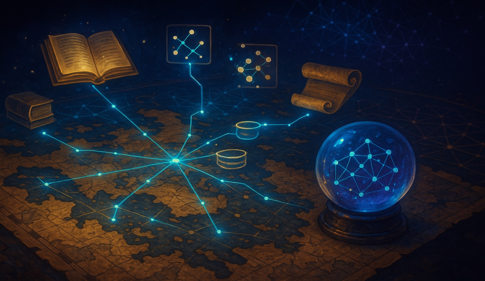

# The Knowledge Cartographer - Agent Mode + MCP Adventure

<a href="#">
    
</a>

### Background

In the vast digital expanse of the Akashic Archives, ancient knowledge fragments are scattered across countless web domains, hidden in articles, papers, and digital archives. As a Knowledge Cartographer, you have been chosen to discover, extract, and weave these fragments into an interconnected knowledge graph that reveals the hidden connections between concepts, ideas, and wisdom.

The Great Library's Council has tasked you with building the Omniscient Codex - a living knowledge system that can traverse the web, capture insights, organize them into a searchable knowledge base, and reveal the invisible threads that connect all human understanding.

### Objective

Your mission is to create a comprehensive knowledge discovery and mapping system that combines the power of web exploration with intelligent local knowledge organization. You'll build an autonomous research assistant that can gather information from multiple sources, identify relationships between concepts, and create a navigable knowledge graph.

**In this adventure, you'll learn to use GitHub Copilot Agent Mode with MCP (Model Control Protocol) tools** - extending AI capabilities with external tools for web search and file system operations!

### Prerequisites

Before starting this adventure, you'll need to perform the following steps:

1. **Install VS Code** - Download the latest version from [VS Code](https://code.visualstudio.com/).
2. **Set up GitHub Copilot in VS Code** - Follow the instructions at [Set up GitHub Copilot in VS Code](https://code.visualstudio.com/docs/copilot/setup).
3. **Configure MCP Servers** - Set up Model Context Protocol servers for extended capabilities:
   - **Web Search MCP Server** - For discovering knowledge across the web. Install the `MCP FireCrawl` server for advanced web scraping from the [MCP gallery](https://code.visualstudio.com/mcp).
   - **File System MCP Server** - For organizing and storing knowledge locally. Install the `MCP File System` server for managing files and directories.

### Learning Outcomes

By completing this adventure with Agent Mode + MCP, you'll learn:

- ✅ How to integrate MCP tools with AI-powered development
- ✅ How to build systems that combine web discovery with local knowledge management
- ✅ How to create knowledge graphs and relationship mapping
- ✅ How to design autonomous research workflows
- ✅ Best practices for MCP tool integration and error handling

### Setting Up Agent Mode with MCP

1. **Open VS Code** and ensure you're signed in to GitHub with GitHub Copilot access.
2. **Configure MCP Servers** using one of these methods:

   **Method A: Direct Installation from Curated List**
   - Open GitHub Copilot and select "Agent" mode
   - Click the tools 🛠️ icon in the chat view
   - Click "Add More Tools..." then "Add MCP Server"
   - Browse the curated list and install `Firecrawl`
   - See the `MCP Tools Required` and `Sample MCP Configuration` sections below to install the `File System MCP Server`

   **Method B: Workspace Configuration**
   - Create a `.vscode/mcp.json` file in your workspace root
   - Add MCP server configurations (see the `MCP Tools Required` and `Sample MCP Configuration` sections below)
   - This allows sharing configurations with team members

   **Method C: User Configuration** 
   - Open Command Palette (`Ctrl+Shift+P` / `Cmd+Shift+P`)
   - Run "MCP: Open User Configuration"
   - Configure servers to be available across all of your VS Code workspaces

3. **Verify MCP Integration**:
   - Open GitHub Copilot by selecting the icon in the top bar
   - Select "Agent" mode from the dropdown at the bottom of the Chat panel
   - Look for available MCP tools in the tools list and ensure `Firecrawl` and `File System` tools are selected
   - Don't see the tools? Make sure that both MCP servers are running and properly configured.

### MCP Tools Required

This adventure integrates two essential MCP servers:

🔍 **FireCrawl MCP Server**
- **Purpose**: Advanced web scraping and content extraction with JavaScript rendering
- **Capabilities**: Scrape single/multiple URLs, search web, extract structured data, batch processing
- **Use Cases**: Research content discovery, web data extraction, source analysis, parallel scraping
- **Package**: `firecrawl-mcp` (actively maintained by Mendable AI)

📁 **File System MCP Server**
- **Purpose**: Organize and manage knowledge files locally
- **Capabilities**: Create, read, write, and organize files and directories
- **Use Cases**: Knowledge base storage, graph data persistence, content archiving
- **Package**: `@modelcontextprotocol/server-filesystem`

#### Sample MCP Configuration (.vscode/mcp.json)

Get a Firecrawl API key from https://www.firecrawl.dev/app/api-keys.

```json
{
  "servers": {
      "firecrawl": {
         "command": "npx",
         "args": [
            "-y", 
            "firecrawl-mcp"
         ],
         "env": {
            "FIRECRAWL_API_KEY": "${input:fireCrawlApiKey}"
         }
      },
      "filesystem": {
         "command": "npx",
         "args": [
            "-y",
            "@modelcontextprotocol/server-filesystem", 
            "${workspaceFolder}"
         ]
      }
   },
   "inputs": [
      {
         "type": "promptString",
         "id": "fireCrawlApiKey",
         "description": "Firecrawl API Key",
         "password": true
      }
   ]
}
```

**Security Note**: Use input placeholders (`${input:variableName}`) for sensitive data like API keys rather than hardcoding them. VS Code will prompt for these values when needed.

### Specifications

Now let's define the requirements for the Knowledge Cartographer system:

1. **Knowledge Discovery Engine:**
   - Web scraping integration using FireCrawl MCP tools
   - Advanced content extraction with JavaScript rendering
   - Multi-source URL processing and batch scraping
   - Topic relationship identification and source analysis

2. **Knowledge Graph Builder:**
   - Entity extraction from discovered content
   - Relationship mapping between concepts
   - Graph data structure implementation
   - Visual representation capabilities

3. **Local Knowledge Base:**
   - File system organization using MCP file tools
   - Structured knowledge storage (JSON, Markdown, etc.)
   - Search and retrieval capabilities

4. **Interactive Exploration Interface:**
   - Command-line interface for knowledge exploration
   - Graph visualization and navigation
   - Query system for finding connections
   - Export capabilities for different formats

### Using Agent Mode with MCP to Solve the Adventure

#### Step 1: Give Agent Mode a Comprehensive MCP-Integrated Task

In the Chat panel with "Agent" mode selected, provide a comprehensive prompt such as the following. While this prompt uses JavaScript and Node.js, feel free to adapt it to your preferred language or framework. This prompt assumes you've already configured the MCP servers as described above.

```
Create a complete Knowledge Cartographer system using GitHub Copilot Agent Mode with MCP tools. This should be a two-phase process:

PHASE 1: Use MCP Tools to Gather and Organize Knowledge
First, use Agent Mode with the configured Firecrawl and server-filesystem MCP servers to collect and organize knowledge data:

1. Use FireCrawl MCP Server tools to:
   - Scrape web content about topics like "quantum computing" and "artificial intelligence".
   - Extract key entities, concepts, and relationships from the scraped content
   - Analyze content quality and source credibility

2. Use File System MCP Server tools to:
   - Create a structured knowledge base directory ./akashic-archives-demo. Place the directory in the root of your workspace.
   - Organize data into topics/ and indexes/ subdirectories
   - Save entities, relationships, and sources as JSON files (entities.json, relationships.json, sources.json)
   - Create metadata and index files for each knowledge domain

PHASE 2: Create Application to Explore the Knowledge Base
Create a Node.js/JavaScript application that reads and analyzes the organized data. Only use the fs, path, and readline modules from Node.js. Do not use any external libraries or frameworks.

3. Build a Knowledge Base Reader:
   - Read the structured JSON files created by MCP tools
   - Load entities, relationships, and source information from ./akashic-archives-demo
   - Support multiple knowledge domains/topics

4. Implement Knowledge Graph Analysis:
   - Analyze relationships between entities
   - Identify connection patterns and strengths  
   - Explore concept clusters and associations

5. Create Interactive Exploration Interface:
   - Command-line interface for browsing knowledge domains
   - Commands to load topics, find entity connections, explore relationships
   - Show original source materials and metadata
   - Beautiful mystical-themed console output

6. Add comprehensive error handling and documentation

The key architecture: MCP Tools → Structured Files → Your Application
- MCP tools handle external operations (web scraping, file organization)
- Your application focuses on reading, analyzing, and exploring the data

Please implement this complete system with sample knowledge domains and demonstrate the exploration workflow.
```

#### Step 2: Watch Agent Mode Work with MCP Integration

Agent Mode will autonomously:
- 🔗 **Connect** to MCP servers and verify tool availability
- 📁 **Phase 1**: Upon your approval, use File System MCP to create directories.
- 🕷️ **Phase 1**: Upon your approval, use FireCrawl MCP to scrape web content and extract knowledge. Write to files using File System MCP.
- 💻 **Phase 2**: Create a Node.js application that reads the organized data
- 🧠 **Phase 2**: Build knowledge graph analysis and exploration features
- 🧪 **Test** the complete system including MCP data flow and application logic
- 🔧 **Handle** errors and edge cases gracefully

You'll see each step in the UI, including MCP tool invocations and results.

#### Step 3: Interact and Refine with MCP Capabilities

As Agent Mode works, you can:
- **Request enhancements**: "Add support for academic paper discovery through FireCrawl scraping"
- **Explore outputs**: "Show me the knowledge graph for the topic we just researched"
- **Add features**: "Create a feature to export knowledge graphs as interactive HTML"

#### Step 4: Explore Advanced MCP Features

Once your Knowledge Cartographer system works, try asking Agent Mode to:

```
Enhance the Knowledge Cartographer with these advanced MCP integrations:
1. Implement knowledge graph merge capabilities for multiple sources
2. Create automated knowledge update workflows
3. Add support for multimedia content discovery and organization
4. Build knowledge sharing and export pipelines
5. Implement advanced graph analytics and insights
6. Create knowledge recommendation systems
7. Add integration with external knowledge bases and APIs
```

### Expected Output

When your Agent Mode implementation is complete, running the application should produce output similar to the following. AI is non-deterministic, so your results may vary slightly, but the structure should be similar.

```
🗺️  Welcome to the Knowledge Cartographer! 🗺️

You are exploring the Akashic Archives - a mystical knowledge base
that has been discovered and organized by the MCP spirits of the web.

The FireCrawl spirits have gathered knowledge from across the digital realm,
while the File System spirits have organized it into sacred scrolls.

Your task: Navigate this treasure trove of interconnected wisdom.

🔮 Initializing archive exploration systems...
        
✅ Akashic Archives detected at: ./akashic-archives
📚 Available knowledge domains: 2 topics discovered
🌟 Archives ready for exploration!

📖 Loading knowledge domain: quantum-computing
✅ Loaded 5 entities
✅ Loaded 4 relationships
✅ Loaded 3 sources
🔮 Knowledge domain ready for exploration!

🌟 Knowledge Domain: QUANTUM COMPUTING
📊 Overview:
   • Entities: 5
   • Relationships: 4
   • Sources: 3
   • Created: 7/15/2025

🔍 Top Entities by Frequency:
   ├── quantum bit (appears 3 times)
   │   └── concepts: quantum mechanics, computation
   ├── superposition (appears 2 times)
   │   └── concepts: quantum mechanics
   ├── entanglement (appears 2 times)
   │   └── concepts: quantum mechanics
   ├── Shor's algorithm (appears 2 times)
   │   └── concepts: cryptography, algorithms
   └── quantum gate (appears 1 times)
       └── concepts: computation, quantum mechanics
```

### Agent Mode Tips

<a href="#">
    
</a>

### Important MCP Considerations

**Security and Privacy:**
- Secure your FireCrawl API key using input placeholders
- Implement appropriate data sanitization for scraped content by defining rules in the prompt
- Consider rate limiting and respectful scraping practices
- Follow security best practices for web scraping and external integrations

### Troubleshooting MCP Integration

If MCP tools aren't working:

1. **Check VS Code version**: Ensure you have the [latest version of VS Code](https://code.visualstudio.com/) with MCP support
2. **Verify GitHub Copilot**: Confirm GitHub Copilot is enabled and configured correctly
3. **Review MCP configuration**: Check your MCP server configurations

### What's Next?

After using Agent Mode with MCP through this adventure:

1. **Explore other MCP servers and tools** - Visit https://code.visualstudio.com/mcp to discover more MCP servers
2. **Build MCP-powered workflows** - Create systems that span multiple tools and services
3. **Contribute to MCP ecosystem** - Develop custom MCP servers for specialized needs

🗺️ Happy knowledge cartography! May your explorations reveal the hidden connections that bind all knowledge together! 🗺️