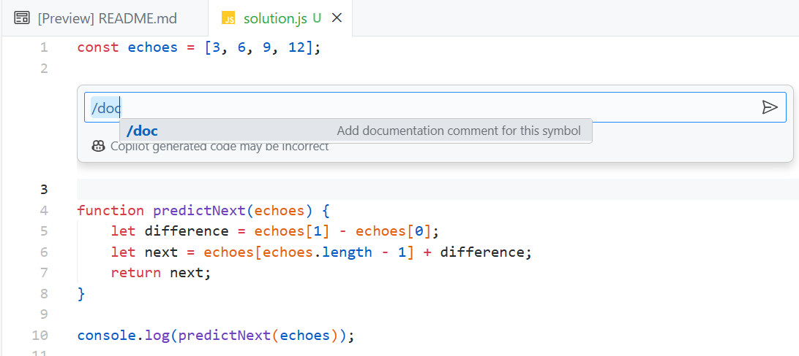

## Avventura di riscaldamento di GitHub Copilot

<a href="#">
    
</a>

GitHub Copilot è uno strumento basato sull' AI che ti aiuta a scrivere un codice migliore. In questa avventura di riscaldamento avrai l'opportunità di conoscere Copilot e provarlo da solo. Ecco alcune cose che puoi fare con GitHub Copilot:

- Converti i commenti in codice. Hai bisogno di fare una chiamata HTTP, filtrare un array o eseguire un altro compito? Scrivi un commento e Copilot lo convertirà in codice per te.
- Crea un'interfaccia utente. Usa HTML/CSS/JavaScript puro o una libreria/framework a tua scelta.
- Crea query SQL.
- Crea unit test.
- Scrivi codice in un nuovo linguaggio.
- Spiega il codice su cui stai lavorando.
- E altro ancora!

Se sei completamente nuovo a GitHub Copilot, guarda questo video per saperne di più sui vantaggi che può portare al tuo flusso di lavoro di sviluppo. Una volta che hai guardato il video, torna qui e scegli un'avventura per iniziare.

[](https://www.youtube.com/watch?v=Dlt-DCLHnxM)

## Iniziare: Installazione dell'estensione GitHub Copilot

Segui i passaggi seguenti per installare l'estensione GitHub Copilot in Visual Studio o Visual Studio Code.

1. Installa [Visual Studio](https://visualstudio.microsoft.com/) o [Visual Studio Code](https://code.visualstudio.com/) se non lo hai già.

1. Installa GitHub Copilot seguendo i passaggi su https://docs.github.com/en/copilot/getting-started-with-github-copilot.

1. Installa GitHub Copilot Chat seguendo i passaggi su https://docs.github.com/en/copilot/github-copilot-chat/using-github-copilot-chat.

## E se non ho una licenza GitHub Copilot?

Se attualmente non hai una licenza GitHub Copilot, puoi:

- [Iscriviti per una prova gratuita](https://github.com/login?return_to=%2fgithub-copilot%2fsignup).
- Se hai un codice coupon, <a href="../README.it-IT.md#coupon">visualizza le istruzioni per usarlo.</a>.

## La tua prima avventura: La Camera degli Echi

Iniziamo con la tua prima avventura!

<a href="#">
    
</a>

### Contesto:

Sulla collina più alta, con vista sul regno, si erge il maestoso Castello Echo. All'interno delle sue mura di pietra si trova una camera conosciuta come la Stanza dell'Eco. Questa camera, a differenza di qualsiasi altra, ha il potere mistico di fare eco ai numeri a chiunque entri. Tuttavia, la Stanza dell'Eco non fa eco a qualsiasi numero; fa sempre eco al numero successivo in una sequenza.

Le leggende raccontano di un mago che ha incantato questa camera per mettere alla prova l'intelletto dei visitatori. La stanza farebbe eco ai numeri in sequenza, e solo quelli che potevano prevedere il prossimo eco erano considerati degni dei tesori nascosti del castello.

### Obiettivo:

Il tuo compito è entrare nella Stanza dell'Eco e ascoltare la sua sequenza, poi prevedere il prossimo numero che farà eco. Ti sono stati forniti una serie di numeri che la stanza ha fatto eco in passato. Usa questi numeri per determinare il prossimo nella sequenza.

### Specifiche:

1. **Input**:
    - Una lista di almeno tre numeri che formano una sequenza. Questa lista rappresenta i numeri che la stanza ha fatto eco in passato.
    
2. **Output**:
    - Un singolo numero che rappresenta il prossimo numero nella sequenza.

3. **Presupposti**:
    - La sequenza sarà sempre una progressione aritmetica (La differenza tra i numeri consecutivi è costante).

### Dati di esempio:

Considera la sequenza: [3, 6, 9, 12]

Il prossimo numero fatto eco dalla stanza dovrebbe essere: 15

### Vincoli:

- La seguente soluzione utilizza JavaScript e Node.js, ma puoi usare Copilot per scrivere il codice in un altro linguaggio se preferisci.

### Riassunto delle attività ad alto livello da eseguire:

1. Usa un'applicazione console per visualizzare l'output.
1. Crea una costante per contenere la sequenza numerica fornita.
1. Determina la differenza comune tra i numeri consecutivi.
1. Prevedi il prossimo numero nella sequenza utilizzando il modello identificato.

### Passaggi di GitHub Copilot

Questa soluzione utilizza JavaScript e [Node.js](https://nodejs.org). Sentiti libero di usare un altro linguaggio/framework se preferisci.

1. Crea un file chiamato `echo-chamber.js` in una cartella a tua scelta.

1. Aggiungi una `const` chiamata `echoes` per contenere la sequenza numerica nel file:

    ```js
    const echoes = [3, 6, 9, 12];
    ```

1. Digita il seguente codice dopo la costante `echoes`. Copilot dovrebbe suggerire il codice per aiutarti a determinare la differenza tra i numeri consecutivi nella sequenza.

    ```js
    function predictNext(echoes) {
    ```

1. Per accettare il suggerimento, premi <kbd>Tab</kbd>. Dovrebbe essere aggiunto il seguente corpo di funzione. Nota che potresti vedere un suggerimento di codice diverso.

    ```js
    function predictNext(echoes) {
        let difference = echoes[1] - echoes[0];
        let next = echoes[echoes.length - 1] + difference;
        return next;
    } 
    ```

1. Inserisci una nuova riga dopo la funzione e Copilot dovrebbe suggerire un codice simile al seguente. Se non lo fa, inizia a digitare `console.log`. Per accettare il suggerimento, premi <kbd>Tab</kbd>.

    ```js
    console.log(predictNext(echoes));
    ```

1. Sposta il cursore sopra la funzione `predictNext` e seleziona <kbd>CTRL + i</kbd> (Windows) o <kbd>CMD + i</kbd> (Mac).

1. Inserisci `/doc` nella casella di testo che appare e premi <kbd>Enter</kbd>. Dovresti vedere un commento generato per la funzione.

    

1. Seleziona `Accetta` per accettare il suggerimento.

1. Dovresti vedere che viene generato un commento per la funzione.

    **NOTA:** Oltre a generare la documentazione, puoi anche usare i commenti per generare il codice.

1. Ora supponiamo che tu voglia memorizzare i "ricordi" dei numeri precedenti fatti eco dalla stanza. Aggiungi il seguente codice dopo la variabile `echoes`.

    ```js
    const memories = [];
    ```

1. Aggiungi il seguente commento immediatamente **sopra** l'istruzione `return next` nella funzione `predictNext` e premi <kbd>Enter</kbd>. Accetta il suggerimento premendo <kbd>Tab</kbd>.

    ```js
    // Memorizza la sequenza completa compreso il numero previsto in memories
    ```

1. Dovresti vedere un codice simile al seguente generato:

    ```js
    memories.push(...echoes, next);
    ```

1. Salva `echo-chamber.js` e apri una finestra del terminale nella cartella in cui hai creato il file.

1. Esegui il seguente comando per eseguire il codice. Questo presuppone che tu abbia installato [Node.js](https://nodejs.org).

    ```bash
    node echo-chamber.js
    ```

1. Dovresti vedere `15` stampato sulla console che è il prossimo numero nella sequenza.

1. Vedi se riesci a far uscire Copilot i ricordi sulla console per te aggiungendo un commento.

## Il tesoro nascosto del Castello Echo è ora tuo!

<a href="#">
    
</a>

Hai completato la tua prima avventura di "riscaldamento" di GitHub Copilot! Dai un'occhiata alle altre avventure situate nella cartella [Adventures](../Adventures) per vedere altri modi in cui GitHub Copilot può essere utilizzato.