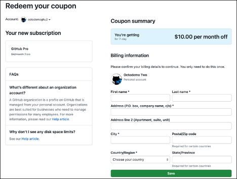
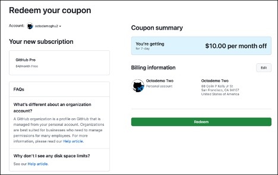
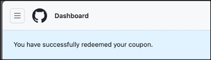
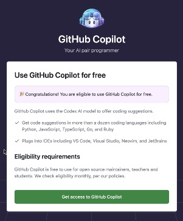
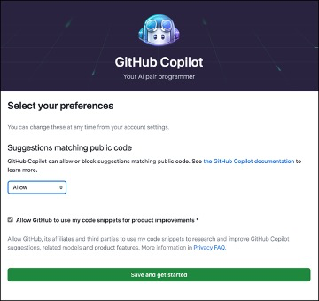
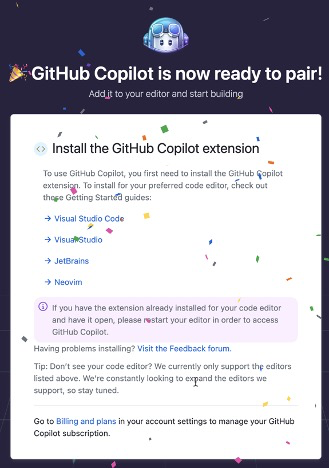

<a href="#">
    
</a>

Benvenuto in Copilot Adventures! Questa serie di avventure di programmazione riguarda l'apprendimento di nuovi concetti e linguaggi utilizzando [GitHub Copilot](https://github.com/features/copilot) per aiutarti a scrivere codice. Cominciamo!

## Scegli la tua avventura Copilot

<a href="#">
    
</a>

### 1. Entra nell'Arena dell'Avventura

Per iniziare, entra nell'"arena dell'avventura" cliccando il pulsante qui sotto. Questo creerà un GitHub Codespace in cui potrai lavorare. Una volta caricato, seleziona il pulsante **Crea codespace**.

[](https://codespaces.new/microsoft/CopilotAdventures)

**NOTA:** Puoi utilizzare 60 ore di GitHub Codespaces [gratuitamente](https://github.com/features/codespaces#pricing) ogni mese.

Se preferisci, puoi clonare il repository ed eseguirlo localmente:

```bash
git clone https://github.com/microsoft/copilotadventures
```

### 2. Scegli un'avventura

**Prerequisiti:** È utile avere una conoscenza di base dei linguaggi di programmazione.

#### Nuovo su GitHub Copilot?

Se sei nuovo su GitHub Copilot, devi installare le estensioni e vuoi imparare come iniziare a usarlo, inizia con l'[Avventura di Riscaldamento](./Adventures/StartHere.it-IT.md).

Una volta completata l'avventura di riscaldamento e installate le estensioni, scegli un'altra avventura di GitHub Copilot dalla lista qui sotto:

#### Avventure per principianti

- [La città meccanica di Tempora](./Adventures/1-Beginner/it-IT/The-Clockwork-Town-of-Tempora.md)
- [La foresta magica di Algora](./Adventures/1-Beginner/it-IT/The-Magical-Forest-of-Algora.md)

#### Avventure intermedie

- [L'allineamento celestiale di Lumoria](./Adventures/2-Intermediate/it-IT/The-Celestial-Alignment-of-Lumoria.md)
- [Il duello leggendario di Stonevale](./Adventures/2-Intermediate/it-IT/The-Legendary-Duel-of-Stonevale.md)
- [I rotoli di Eldoria](./Adventures/2-Intermediate/it-IT/The-Scrolls-of-Eldoria.md)

#### Avventure avanzate

- [L'arena di ingorgo di Mythos](./Adventures/3-Advanced/it-IT/The-Gridlock-Arena-of-Mythos.md)

### 3. Inizia a programmare

Leggi la descrizione della tua avventura Copilot, le attività ad alto livello da eseguire e i suggerimenti di GitHub Copilot per aiutarti a scrivere il tuo codice.

- Usa [GitHub Copilot](https://docs.github.com/en/copilot/getting-started-with-github-copilot) e/o [GitHub Copilot Chat](https://docs.github.com/en/copilot/github-copilot-chat/using-github-copilot-chat) per aiutarti a scrivere il codice per l'avventura. Puoi usare qualsiasi linguaggio tu preferisca. Prova a imparare un nuovo linguaggio se sei pronto per la sfida (più su)!
- Lascia eventuali commenti nel tuo codice per spiegare il tuo processo di pensiero e mostrare i suggerimenti che GitHub Copilot ha usato per aiutarti.

### 4. Invia la tua soluzione d'avventura (facoltativo)

Se desideri condividere la tua soluzione con gli altri, esegui i seguenti passaggi:

- Pubblica la tua soluzione d'avventura su un repository GitHub.
- Visita https://github.com/microsoft/CopilotAdventures/issues e seleziona `Nuova Issue`.
- Usa la seguente convenzione di denominazione per il titolo dell'issue.

    ```
    Soluzione per [Nome della tua avventura]
    ```

    Sostituisci `[Nome della tua avventura]` con il nome dell'avventura che hai scelto di risolvere (esempio: `Il duello leggendario di Stonevale`).

- Aggiungi un link al tuo repository GitHub nella sezione del corpo.
- Se hai qualche feedback, condividi quello che hai trovato (buono o cattivo). Ci piacerebbe sentire il tuo feedback!

## Prossimi passaggi: Impara un nuovo linguaggio o crea un'interfaccia utente per la tua avventura

<a href="#">
    
</a>

Una volta completata la tua prima avventura, provaci di nuovo ma questa volta usa GitHub Copilot per completare l'avventura utilizzando un linguaggio che ti è nuovo. Ad esempio, se normalmente scrivi codice in C#, usa Copilot per aiutarti a risolvere l'avventura utilizzando Python o un altro linguaggio che vorresti imparare di più.

Prova a creare un'interfaccia utente per la tua avventura. Usa HTML/CSS/JavaScript puro o una libreria/framework a tua scelta. Lascia che GitHub Copilot/Chat ti aiuti con il codice dell'interfaccia utente. Se la tua interfaccia utente richiede immagini, considera l'uso di [Bing Image Creator](https://www.bing.com/create) o un altro servizio di generazione di immagini AI.

## Hai un'idea per un'Avventura Copilot? Invia una PR!

Hai una storia/enigma per un'avventura Copilot che ti piacerebbe proporre per gli altri? Ci piacerebbe vederlo! Invia una pull request a questo repository con la tua avventura e soluzione.

- Usa `Nuova Avventura Copilot: [Nome della tua Avventura]` per il titolo della PR. Sostituisci `[Nome della tua Avventura]` con il nome della tua avventura.
- Indica se la tua avventura è a livello principiante, intermedio o avanzato.
- Segui il template markdown usato con ogni avventura nella cartella [Avventure](./Adventures) mentre crei la tua avventura.
- Fornisci un'immagine per la tua avventura (usa [Bing Image Creator](https://www.bing.com/create) o un'altra soluzione di generatore di immagini).
- Fornisci una soluzione utilizzando il tuo linguaggio preferito. Metti tutto il codice in un unico file (per mantenere le cose semplici) e includilo nella PR.

Esamineremo la tua proposta e la uniremo al repository se soddisfa i criteri.

## <a name="coupon"></a>Istruzioni per Riscattare un Coupon del Workshop GitHub Copilot

1. Accedi a GitHub.

1. Vai a https://github.com/redeem/XXX-YYY dove XXX-YYY è il codice coupon per il tuo workshop.

    

1. Compila il tuo indirizzo. Non ti verrà chiesto di inserire una Carta di Credito.

1. Seleziona `Salva`.

1. Nella pagina di riepilogo del coupon, seleziona `Riscatta`.

    

1. Dovresti ricevere un messaggio sulla tua dashboard di GitHub.

    

1. Visita https://gh.io/copilot-free. Questo passaggio è necessario dopo aver riscattato il coupon. Non avrai accesso a GitHub Copilot fino a quando non ti sarai iscritto e configurato le tue preferenze.

1. Seleziona `Ottieni accesso a GitHub Copilot`.

    

1. Scegli le impostazioni necessarie per il workshop (ad esempio seleziona `Consenti`) e poi seleziona `Salva e inizia`.

    

1. Dovresti ora avere accesso a GitHub Copilot per 7 giorni!

    