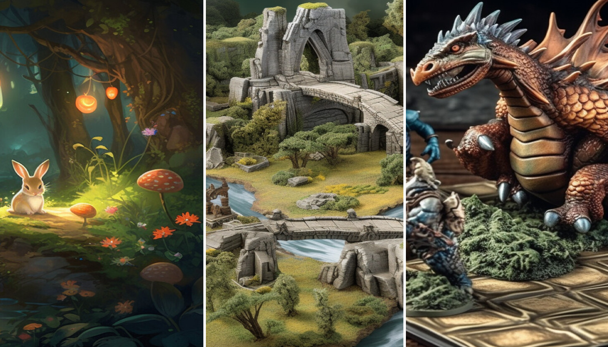

<a href="#">
    
</a>

Welcome to Copilot Adventures! This series of coding adventures is all about learning new concepts and languages by using [GitHub Copilot](https://github.com/features/copilot) to help you write code. Let's get started!

<a href="https://developer.microsoft.com/en-us/reactor/events/21031/?wt.mc_id=eventspg_21031_webpage_reactor" target="_blank">
    
</a>

## Choose Your Own Copilot Adventure

<a href="#">
    
</a>

### 1. Enter the Adventure Arena

To get started, enter the "adventure arena" by clicking the button below. This will create a GitHub Codespace that you can work in. Once it loads select the **Create codespace** button.

[](https://codespaces.new/DanWahlin/CopilotAdventures)

**NOTE:** You can use 60 hours of GitHub Codespaces [for free](https://github.com/features/codespaces#pricing) each month.

If you'd prefer, you can clone the repo and run locally:

```bash
git clone https://github.com/danwahlin/copilotadventures
```

### 2. Choose an Adventure

Pre-Reqs: Basic programming language knowledge is helpful.

New to GitHub Copilot? Start with the [Warmup Adventure](./Adventures/StartHere.md) to learn the basics.

Once you've completed the warmup adventure, choose another one from the list below:

#### Beginner Adventures

- [The Clockwork Town of Tempora](./Adventures/1-Beginner/The-Clockwork-Town-of-Tempora.md)
- [The Magical Forest of Algora](./Adventures/1-Beginner/The-Magical-Forest-of-Algora.md)

#### Intermediate Adventures

- [The Celestia Alignment of Lumoria](./Adventures/2-Intermediate/The-Celestial-Alignment-of-Lumoria.md)
- [The Legendary Duel of Stonevale](./Adventures/2-Intermediate/The-Legendary-Duel-of-Stonevale.md)
- [The Scrolls of Eldoria](./Adventures/2-Intermediate/The-Scrolls-of-Eldoria.md)

#### Advanced Adventures

- [The Gridlock Arena of Mythos](./Adventures/3-Advanced/The-Gridlock-Arena-of-Mythos.md)

### 3. Start Coding

Read Your Copilot Adventure description, the high-Level steps to perform, and the GitHub Copilot hints to help you write your code.

- Use [GitHub Copilot](https://docs.github.com/en/copilot/getting-started-with-github-copilot) and/or [GitHub Copilot Chat](https://docs.github.com/en/copilot/github-copilot-chat/using-github-copilot-chat) to help you write the code for the adventure. You can use any language you'd like. Try learning a new language if you're up for the challenge (more on that below)!
- Leave any comments in your code to explain your thought process and show prompts that GitHub Copilot used to help you out.

### 4. Submit Your Adventure Solution

Perform the following steps:

- Publish your adventure solution to a GitHub repo. 
- Visit https://github.com/DanWahlin/CopilotAdventures/issues and select `New Issue`.
- Use the following naming convention for the issue title. 

    ```
    Solution for [Name of Your Adventure]
    ```

    Replace `[Name of Your Adventure]` with the adventure name you chose to solve (example: `The Legendary Duel of Stonevale`).

- Add a link to your GitHub repo in the body section.
- If you have any feedback, share what you found (good or bad). We'd love to hear your feedback!

## Next Steps: Learn a New Language or Create a UI for Your Adventure

<a href="#">
    
</a>

Once you've completed your first adventure, try it again but this time use GitHub Copilot to complete the adventure using a language that's new to you. For example, if you normally write code in C#, use Copilot to help you solve the adventure using Python or another language you'd like to learn more about.

Try creating a UI for your adventure. Use pure HTML/CSS/JavaScript or a library/framework of your choosing. Let GitHub Copilot/Chat help you out with the UI code. If your UI requires images, consider using [Bing Image Creator](https://www.bing.com/create) or another AI image generation service.

## Have a Copilot Adventure Idea? Submit a PR!

Do you have a copilot adventure story/puzzle you'd like to submit for others to go through? We'd love to see it! Please submit a pull request to this repository with your adventure and solution. 

- Use `New Copilot Adventure: [Your Adventure Name]` for the PR title. Replace `[Your Adventure Name]` with the name of your adventure.
- Include if your adventure is at the beginner, intermediate, or advanced level.
- Follow the markdown template used with each adventure in the [Adventures](./Adventures) folder as you create your adventure.
- Provide an image for your adventure (use [Bing Image Creator](https://www.bing.com/create) or another image generator solution).
- Provide a solution using your chosen language. Place all of the code in a single file (to keep things simple) and include it in the PR.

We'll review your submission and merge it into the repo if it meets the criteria.
